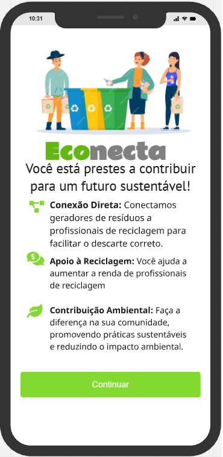
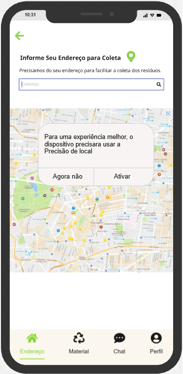
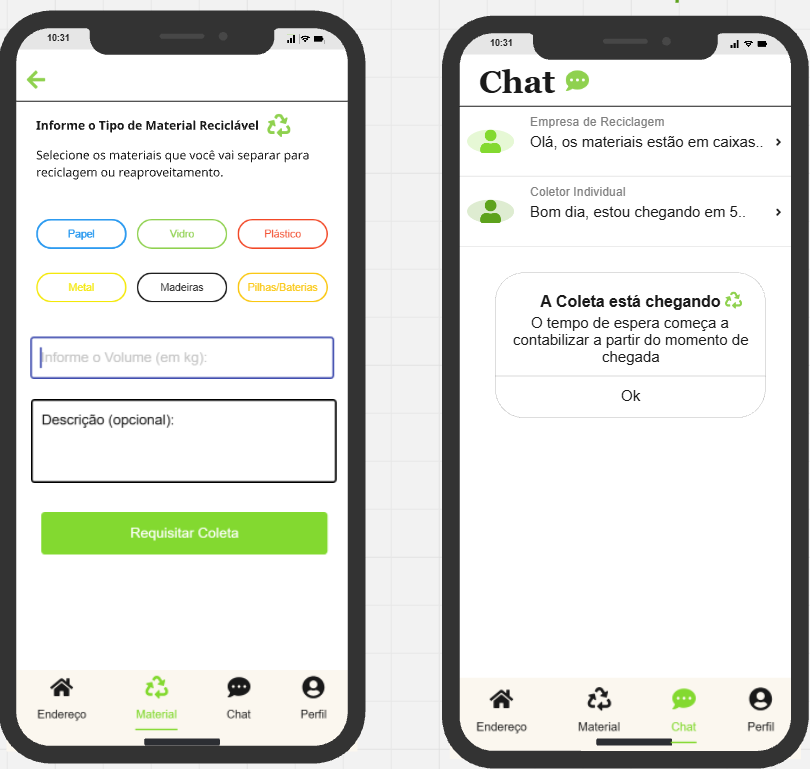

# EcoConecta ♻️  

**EcoConecta** é um aplicativo que conecta cidadãos e empresas de coleta de resíduos, facilitando o descarte correto e promovendo a sustentabilidade. Com o EcoConecta, você pode agendar coletas de resíduos recicláveis e receber notificações sobre serviços disponíveis em sua região.  

---

## Funcionalidades  

- **Solicitação de coletas:** agende coletas de resíduos recicláveis com empresas locais.  
- **Notificações em tempo real:** saiba quando a coleta está a caminho ou foi concluída.  
- **Histórico de coletas:** acompanhe todas as solicitações realizadas.  
- **Sistema integrado com Firebase:** dados em tempo real para um funcionamento rápido e eficiente.  

---

## Imagens do App  

### Tela Inicial  
  
*A interface simples e intuitiva do EcoConecta.*  

### Informe seu Endereço com um mapa interativo  
  
*Informe seu endereço com extrama facilidade.*  

### Requisite Coletas e Utilize um chat em tempo Real 
  
*Faça seus pedidos e converse com a Cooperativa que irá buscar.*  

---

## Como instalar o EcoConecta  

1. **Pré-requisitos:**  
   - Certifique-se de ter o **Flutter** instalado no seu computador.  
   - Configure o ambiente de desenvolvimento para Android ou iOS.  

2. **Clonando o repositório:**  
   - Acesse o repositório oficial do projeto: [EcoConecta no GitHub](link-do-repositorio).  
   - Clone o repositório usando o comando:  
     ```bash
     git clone https://github.com/seu-repositorio/econecta.git
     ```  

3. **Instalando dependências:**  
   - No diretório do projeto, execute:  
     ```bash
     flutter pub get
     ```  

4. **Configurando o Firebase:**  
   - Adicione o arquivo `google-services.json` (Android) ou `GoogleService-Info.plist` (iOS) ao projeto.  
   - Configure os pacotes do Firebase de acordo com a documentação oficial.  

5. **Executando o app:**  
   - Conecte seu dispositivo ou inicialize um emulador.  
   - Execute:  
     ```bash
     flutter run
     ```  

6. **Pronto!**  
   - Agora você pode começar a usar o EcoConecta.  

---

🌍 **EcoConecta**: facilitando o descarte responsável e construindo um futuro sustentável!  
